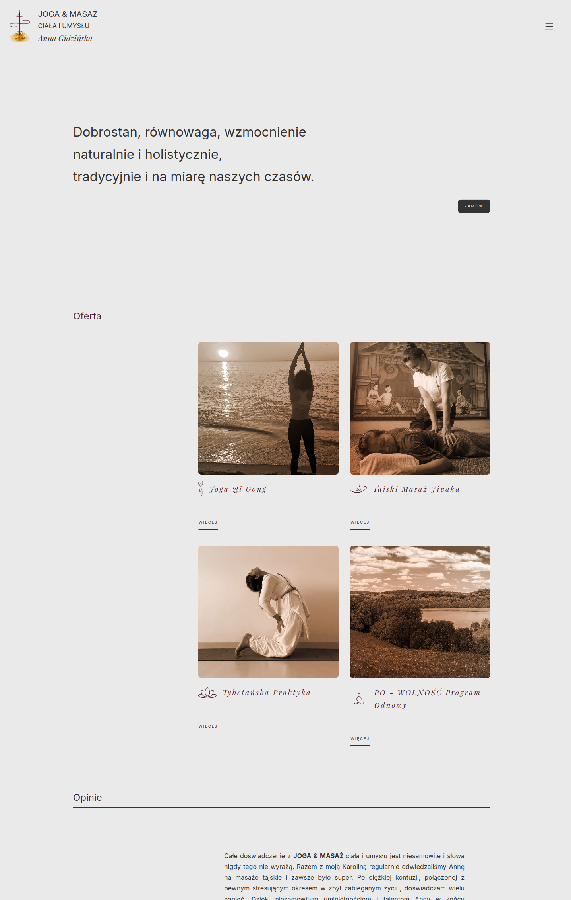

# 🌿 Yoga Massage Anna Gidzińska Website

The "Yoga Massage Anna Gidzińska Website" is a serene and minimalistic one-page web application designed to showcase the professional services of Anna Gidzińska, a dedicated yoga instructor and massage therapist. Built using React, this website emphasizes simplicity, ease of navigation, and a harmonious user experience, reflecting the core values of yoga and massage therapy.

**[Click here to view the full image](src/assets/jogaimasaz.png)**

**[Click here to view the live site](https://jogaimasaz.vercel.app)**

## 🚀 Technologies

 

## ⭐ Key Features:

1. Home:  A welcoming header that introduces users to a calm and inviting atmosphere, aligning with Anna's holistic approach to health and well-being.
2. Offer: A detailed section describing the available services, such as Qi Gong Yoga and Jivaka Thai Massage. Each service is thoroughly explained, allowing visitors to gain a deeper understanding of the techniques offered and their benefits.
3. Courses: Information on the available courses, including dates and levels, from basic to advanced.
4. Reviews: Client testimonials presented in a carousel format, showcasing feedback from those who have benefited from Anna's services.
5. Pricing: A clear and straightforward presentation of the costs for individual services and courses.
6. About: A personal section where Anna shares her professional journey, philosophy, and qualifications, providing a deeper connection with potential clients.
7. News: Updates and articles related to yoga and massage, keeping visitors informed and engaged.
8. Contact: A functional contact form powered by EmailJS, along with all necessary contact details to facilitate easy communication.

## 🤓 Summary 
This project was my first commercial venture and provided me with valuable lessons in client management, time-sensitive project execution, and the ability to dynamically adapt to client requests. It also deepened my experience in React development, SCSS styling, and integrating third-party services like EmailJS.
