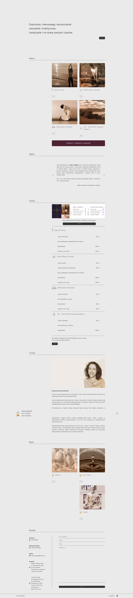

# 🌿 "yoga-massage-anna-gidzinska-website": My first commercial business one-page website in React"
The "yoga-massage-anna-gidzinska-website" is a serene and minimalistic one-page web application designed to showcase the professional services of Anna Gidzińska, a dedicated yoga instructor and massage therapist. Built with React, this website emphasizes simplicity, ease of navigation, and a harmonious user experience, reflecting the core values of yoga and massage therapy.

[Click here to go live](https://yoga-massage-anna-gidzinska-website.vercel.app)

## 🚀 Technologies

## ⭐ Key Features:

1. Home: A header that welcomes users into a calm and inviting atmosphere of the site, emphasizing Anna's holistic approach to health and well-being.
2. Offer: A section that thoroughly describes the available services, such as Qi Gong Yoga and Jivaka Thai Massage. Each service is detailed, allowing visitors to gain a deeper understanding of the techniques offered and their benefits.
3. Courses: Information on the dates and types of available courses, including basic and advanced courses.
4. Reviews: Reviews and testimonials from clients who have utilized Anna's services. Presented in a carousel format.
5. Pricing: A clear presentation of the costs for individual services and courses.
6. About Me: A personal section where Anna shares her experience, life and professional philosophy, as well as information about her education and qualifications.
7. News: Updates and articles.
8. Contact: A contact form and all necessary contact details. Here, I utilized the emailjs package.

## 🤓 Summary 
This project taught me valuable lessons about working with clients, handling time pressure, and adapting to changes dynamically introduced by the client.
